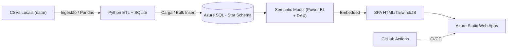
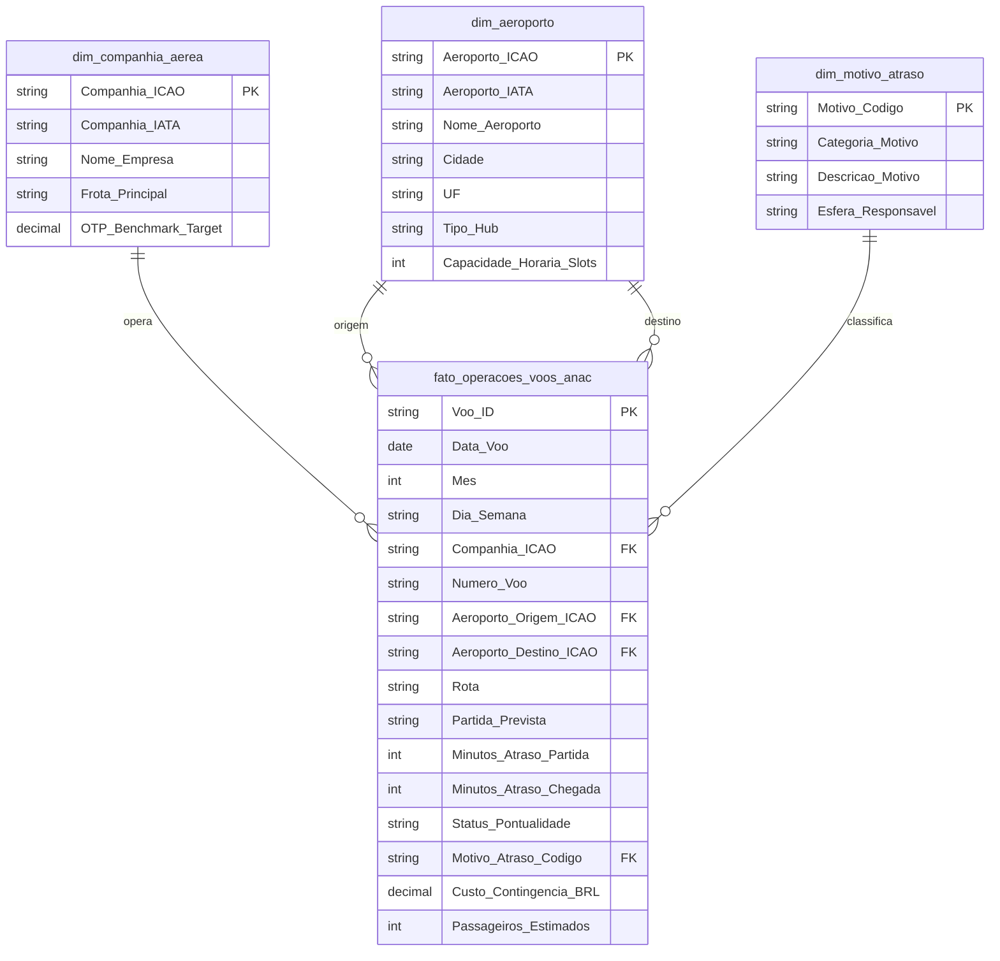

<div align="center">
  

  <h1>🛫 Aerometrics Dashboard</h1>

  <p><strong>Gestão de Risco Operacional, Pontualidade de Voos (OTP D15) e Custos da Resolução ANAC 400</strong></p>
  <p><em>Consultoria de Dados Aéreos — Projeto Final do Bootcamp de Análise de Dados | Generation Brasil 2026</em></p>

  <p>
    
        
    
    
    
    
    

  <br/>

  <h2>
    <a href="https://lively-sky-0d8399010.5.azurestaticapps.net/">
      👉 ACESSAR O DASHBOARD AO VIVO 👈
    </a>
  </h2>
</div>

---

Aplicação web de página única (SPA), responsiva e publicada no **Azure Static Web Apps**. Ela incorpora o relatório **Power BI** do projeto e reúne em um só portal o painel operacional, o **Relatório Executivo de Insights** e a documentação da arquitetura de dados.

O projeto foi construído para **arbitrar com dados um impasse da diretoria** no Centro de Controle Operacional (CCO) da aviação comercial brasileira: **a culpa dos atrasos é do clima ou da operação?**

---

## 📑 Índice

1. [Sumário Executivo](#-1-sumário-executivo)
2. [Contexto do Negócio: O Dilema C-Level](#-2-contexto-do-negócio-o-dilema-c-level)
3. [Perguntas de Negócio](#-3-perguntas-de-negócio)
4. [A Aplicação Web](#️-4-a-aplicação-web)
5. [Arquitetura de Dados e Pipeline](#️-5-arquitetura-de-dados-e-pipeline)
6. [Modelo Dimensional (Star Schema)](#-6-modelo-dimensional-star-schema)
7. [Tecnologias e Metodologias](#️-7-tecnologias-e-metodologias)
8. [Principais Insights e Resultados](#-8-principais-insights-e-resultados)
9. [Relatório Executivo: Recomendações](#-9-relatório-executivo-recomendações)
10. [Pitch Executivo — Método STAR](#-10-pitch-executivo--método-star)
11. [Estrutura do Repositório](#-11-estrutura-do-repositório)
12. [Data Squad](#-12-data-squad)
13. [Glossário](#-13-glossário)

---

## 🎯 1. Sumário Executivo

| Indicador | Resultado |
|---|---|
| ✈️ **Base analisada** | **5.500 etapas de voo** em 2024 (jan–dez), cerca de **933 mil passageiros**, 4 companhias e 11 aeroportos |
| 🏁 **Meta contratual de OTP D15** | **Nenhuma** das 4 companhias atingiu a meta (diferenças de -6,7 a -10,6 p.p.) |
| 🔧 **Atrasos de responsabilidade da companhia** | **50,46%** (Efeito Cascata 29,61% + Manutenção 13,82% + Tripulação 7,03%) |
| 🌦️ **Atrasos exógenos (Clima + ATC)** | **41,88%**, longe dos "100%" defendidos pelo COO |
| 🌐 **Maior propagador do Efeito Cascata** | **GRU (Guarulhos)**, com **29,77%** de todo o efeito dominó nacional |
| 💸 **Custo da assistência material (Res. ANAC 400)** | **R$ 26,4 milhões** |
| 🚀 **Ganho estimado com as recomendações** | **+7,2 p.p.** de OTP D15 global e **mais de R$ 14,8 milhões** a menos em custos contingenciais |

> **Veredito dos dados:** a tese de que os atrasos são *100% exógenos* **não se sustenta**. Mais da metade dos atrasos está sob controle direto das companhias.
---

## 🧭 2. Contexto do Negócio: O Dilema 


| 👨‍✈️ Diretor de Operações (COO) | 💼 Diretor Financeiro (CFO) |
|---|---|
| "A culpa é **100% exógena**: condições meteorológicas e restrições de infraestrutura de tráfego aéreo (DECEA/CGNA)." | "Temos um rombo de **R$ 26,4 milhões** em assistência material (Res. ANAC 400) por causa de uma **malha apertada** e de **falhas de manutenção**." |


**Missão:** analisar os dados de operações de voo da ANAC e **resolver a divergência com evidências**, usando modelagem dimensional, SQL analítico e painéis gerenciais.

---

## ❓ 3. Perguntas de Negócio

| # | Pergunta | Técnica aplicada |
|---|---|---|
| 1 | Qual é a pontualidade (OTP D15) de cada companhia em relação à meta contratual? | Agregações SQL + medidas DAX |
| 2 | Quais causas concentram a maior parte dos atrasos? Elas são internas ou externas? | Diagrama de Pareto (80/20) por esfera responsável |
| 3 | Quais aeroportos multiplicam atrasos e espalham o efeito dominó pela malha? | Window Functions (`OVER`, `LAG`) + análise de filas |
| 4 | Quanto custa a assistência material da Res. ANAC 400 e onde esse custo se concentra? | Auditoria financeira por companhia, aeroporto e motivo |
| 5 | Quais ações operacionais trazem o maior ganho de OTP e a maior economia? | Simulação de cenários + Relatório Executivo |

---

## 🖥️ 4. A Aplicação Web

O portal **Aerometrics** é uma SPA leve, em HTML, Tailwind CSS e JavaScript puro (sem frameworks), organizada em **3 abas**:

| Aba | Conteúdo |
|---|---|
| 📊 **Dashboard** | Relatório **Power BI** incorporado |
| ⚡ **Insights** | **Relatório Executivo** com as recomendações estratégicas, cada uma dividida em *Diagnóstico Operacional*, *Solução Proposta* e *Impacto Esperado* |
| ℹ️ **Sobre o Projeto** | Documentação da arquitetura de dados, da esteira operacional e do time (*Meet Our Team*) |

**Destaques técnicos do frontend:**
- **Roteamento SPA em JavaScript puro** (`js/script.js`): a função `switchTab()` troca as abas sem recarregar a página.
- **Design System** próprio no `tailwind.config.js`, com a paleta da marca Aerometrics (`#005E9E`, `#2EB2B4`, `#1E2E3B`, `#87A4BB`) e as fontes Inter e Roboto.
- **Layout de tela travada** (`h-screen` + `min-h-0`), com rolagem só na área interna, para uma experiência parecida com a de um aplicativo.
- **CI/CD com GitHub Actions**: cada `push` na `main` publica automaticamente no Azure Static Web Apps.

---

## 🏗️ 5. Arquitetura de Dados e Pipeline

A Aerometrics usa um fluxo de engenharia de dados (ETL) que processa os dados operacionais de voos e os carrega em um **banco relacional em nuvem**. Isso garante a consistência dos indicadores de OTP e da Resolução 400.



| Etapa | Tecnologia | Descrição |
|---|---|---|
| **1. Extração** | 🐍 Python (Pandas + SQLite) | Leitura dos CSVs, limpeza, validação de tipos e padronização dos códigos ICAO/IATA |
| **2. Armazenamento** | ☁️ Azure SQL | Star Schema (1 fato e 3 dimensões) salvo na nuvem por carga em massa (Bulk Insert) |
| **3. Modelagem semântica** | 📊 Power BI + DAX | Relacionamentos, medidas de OTP D15, Pareto, Efeito Cascata e custo ANAC 400 |
| **4. Distribuição** | 🌐 Azure Static Web Apps | Relatório incorporado na SPA, com publicação contínua via GitHub Actions |

---

## ⭐ 6. Modelo Dimensional (Star Schema)

O modelo segue as boas práticas de **Ralph Kimball**: uma tabela fato detalhada (uma linha por etapa de voo) ligada a dimensões descritivas.



---

## 🛠️ 7. Tecnologias e Metodologias

### 🧰 Stack

| Camada | Ferramenta | Uso |
|---|---|---|
| Dados | 🐍 **Python (Pandas)** + 🗃️ **SQLite** | ETL, limpeza e preparo para a carga |
| Dados | ☁️ **Azure SQL** | Data Warehouse em nuvem com o Star Schema |
| Analytics | 🧮 **SQL / T-SQL** | CTEs, Window Functions (`OVER`, `PARTITION BY`, `LAG`, `RANK`) |
| BI | 📊 **Power BI Desktop + DAX** | Modelo semântico, medidas e painéis executivos |
| Frontend | 🌐 **HTML5 + Tailwind CSS + JavaScript** | SPA leve e responsiva, sem dependências locais |
| Deploy | 🚀 **Azure Static Web Apps + GitHub Actions** | Hospedagem e CI/CD automatizado |

### 📐 Metodologias

| Metodologia | Aplicação |
|---|---|
| ⭐ **Modelagem Dimensional (Kimball)** | Star Schema com 1 fato e 3 dimensões |
| 📈 **Diagrama de Pareto (80/20)** | Priorização das poucas causas que geram a maior parte dos atrasos |
| ⏱️ **OTP D15 (padrão IATA)** | Voo pontual é o que opera com até 15 min de diferença do horário previsto (cancelamentos ficam fora da base) |
| 🔗 **Reactionary Delays** | Medição dos atrasos herdados de etapas anteriores (efeito cascata) |
| 🚦 **Análise de Filas** | Identificação de hubs saturados e janelas de pico que viram gargalos |

---

## 💡 8. Principais Insights e Resultados

### 🏁 8.1 Ranking On-Time Performance (OTP D15)

| Ranking | Companhia | OTP D15 | Meta contratual | Diferença |
|---|---|---|---|---|
| 🥇 1º | Azul (AZU) | 73,5% | 84% | 🔴 -10,5 p.p. |
| 🥈 2º | LATAM (TAM) | 71,4% | 82% | 🔴 -10,6 p.p. |
| 🥉 3º | Gol (GLO) | 68,4% | 78% | 🔴 -9,6 p.p. |
| 4º | Voepass (PTB) | 62,3% | 69% | 🔴 -6,7 p.p. |

➡️ **Nenhuma companhia atingiu a meta contratual.** O problema é **sistêmico**, não de um único operador. A taxa de cancelamento foi de **2,76%** (152 voos).

### 📈 8.2 Pareto de Causas de Atraso

| Motivo | Esfera | % dos atrasos | % acumulado |
|---|---|---|---|
| 🔗 Efeito Cascata & Conexão (CONEX) | Companhia / Rede | **29,61%** | 29,61% |
| 🌦️ Condições Meteorológicas (CLIMA) | Força Maior | 24,83% | 54,44% |
| 🛰️ Tráfego Aéreo & Slot (ATC) | Infraestrutura | 17,05% | 71,49% |
| 🔧 Manutenção Não Programada (MANUT) | Companhia | **13,82%** | 85,31% |
| 🧳 Operações em Solo (SOLO) | Solo / Aeroporto | 7,66% | 92,97% |
| 👩‍✈️ Jornada da Tripulação (CREW) | Companhia | **7,03%** | 100,00% |

| Esfera | Participação |
|---|---|
| 🔧 **Companhia (CONEX + MANUT + CREW)** | **50,46%** |
| 🌦️ **Exógena (CLIMA + ATC)** | **41,88%** |
| 🧳 **Solo / Aeroporto (SOLO)** | 7,66% |

➡️ **A principal causa individual de atraso não é o clima, e sim o Efeito Cascata.** A visão do COO de que "a culpa é 100% do clima" foi **desmentida pelos dados**.

### 🔗 8.3 Diagnóstico de Propagação (Efeito Cascata)

| Posição | Hub | % do Efeito Cascata nacional |
|---|---|---|
| 🥇 1º | **GRU — Guarulhos** | **29,77%** |
| 🥈 2º | VCP — Viracopos | 13,04% |
| 🥈 2º | BSB — Brasília | 13,04% |
| 4º | CGH — Congonhas | 11,67% |
| 5º | CNF — Confins | 9,14% |

➡️ **Guarulhos é o maior multiplicador de atrasos do país.** Um atraso em GRU contamina as etapas seguintes da aeronave, espalha-se pela rede e pode esgotar o limite de jornada da tripulação definido na **Lei do Aeronauta (Lei nº 13.475/2017)**.

### 💸 8.4 Impacto Regulatório: Resolução ANAC 400

A Resolução ANAC nº 400/2016 obriga a companhia a prestar **assistência material** escalonada ao passageiro:

| Tempo de espera | Obrigação |
|---|---|
| ⏰ A partir de **1 h** | Facilidades de comunicação |
| 🍽️ A partir de **2 h** | Alimentação (voucher ou refeição) |
| 🏨 A partir de **4 h** | Hospedagem (se houver pernoite) e traslado, além de reacomodação, reembolso ou outro meio de transporte |

**Custo total: R$ 26,4 milhões**

| Por companhia | Custo | | Por motivo | Custo |
|---|---|---|---|---|
| Gol (GLO) | R$ 10,92 mi | | Clima | R$ 10,01 mi |
| LATAM (TAM) | R$ 9,06 mi | | **Manutenção** | **R$ 7,52 mi** |
| Azul (AZU) | R$ 5,02 mi | | **Efeito Cascata** | **R$ 3,91 mi** |
| Voepass (PTB) | R$ 1,41 mi | | **Tripulação** | **R$ 2,48 mi** |
| | | | ATC | R$ 1,69 mi |
| | | | Solo | R$ 0,80 mi |

➡️ **R$ 13,9 milhões (52,7% do custo) vêm de causas controláveis pela companhia.** É dinheiro que pode ser recuperado com gestão. Por origem, **GRU sozinho responde por R$ 7,32 milhões**.

---

## 🚀 9. Relatório Executivo: Recomendações

As recomendações abaixo estão na aba **Insights** da aplicação:

### 1️⃣ Buffer operacional de 15 minutos nos slots críticos

| | |
|---|---|
| 🔍 **Diagnóstico** | A pontualidade (OTP D15) cai muito e o atraso médio cresce rapidamente nos **horários de pico (07h–09h e 17h–20h)**. |
| 🛠️ **Solução** | Reajustar os slots **HOTRAN** e as grades horárias dos aeroportos de alta densidade (com destaque para **GRU**), com um **buffer técnico de 15 minutos** nos picos. |
| 📈 **Impacto** | A folga absorve pequenos imprevistos de solo e de pista antes que eles virem efeito dominó, estabilizando a operação desde o início do dia. |

### 2️⃣ Reserva tática de aeronaves e tripulações

| | |
|---|---|
| 🔍 **Diagnóstico** | O Efeito Cascata, liderado por **GRU (~29,8%)**, compromete voos seguidos e esgota a jornada da tripulação (Lei nº 13.475/2017). |
| 🛠️ **Solução** | Manter **aeronaves e tripulações de reserva** nos principais hubs para assumir etapas críticas em caso de quebra operacional. |
| 📈 **Impacto** | Isola o resto da malha, com **+7,2 p.p. no OTP D15 global** e **mais de R$ 14,8 milhões** a menos em custos da Res. ANAC 400. |

---

## 🎤 10. Pitch Executivo — Método STAR

| Etapa | Descrição |
|---|---|
| **S — Situação** | Crise de pontualidade na aviação brasileira. O COO atribuía 100% dos atrasos ao clima e ao controle de tráfego aéreo. O CFO apontava R$ 26,4 milhões em custos da Res. ANAC 400 causados por malha apertada e falhas de manutenção. |
| **T — Tarefa** | Como Data Squad da Aerometrics, resolver o impasse com evidências: achar a origem real dos atrasos, os gargalos da malha e o impacto financeiro. |
| **A — Ação** | Construímos um pipeline Python → Azure SQL com Star Schema (Kimball), aplicamos SQL analítico (CTEs, Window Functions) para o Pareto e o Efeito Cascata, criamos o painel no Power BI com DAX e o publicamos em uma SPA no Azure Static Web Apps com CI/CD. |
| **R — Resultado** | Mostramos que **50,46% dos atrasos são controláveis**, que **nenhuma companhia bate a meta de OTP D15** e que **GRU concentra 29,77% do Efeito Cascata**. Propusemos ações com potencial de **+7,2 p.p. de OTP** e **mais de R$ 14,8 milhões de economia**. |

---

## 📁 11. Estrutura do Repositório

```text
aerometrics-dashboard/
├── .github/
│   └── workflows/
│       └── azure-static-web-apps-*.yml   # CI/CD: deploy automático no Azure Static Web Apps
├── assets/
│   ├── logo_aerometrics_v2.png           # Logo principal / favicon
│   ├── logo_aerometrics_white.png        # Logo versão clara
│   ├── logo_anac.png                     # Marca ANAC
│   └── team/                             # Fotos do Data Squad
├── css/
│   └── style.css                         # Estilos customizados (abas e animações)
├── data/
│   ├── fato_operacoes_voos_anac.csv      # Tabela fato (5.500 etapas de voo)
│   ├── dim_companhia_aerea.csv           # Dimensão companhias
│   ├── dim_aeroporto.csv                 # Dimensão aeroportos
│   └── dim_motivo_atraso.csv             # Dimensão motivos de atraso
├── js/
│   └── script.js                         # Roteamento SPA (switchTab)
├── pbi/
│   ├── Projeto Generation Brasil - Anac - V007.pbix
│   └── Projeto Generation Brasil - Anac - V008.pbix   # Versão publicada
├── index.html                            # Estrutura principal da SPA
├── tailwind.config.js                    # Design System (paleta e tipografia)
└── README.md
```

---

## 👥 12. Data Squad

Projeto desenvolvido de forma **colaborativa** pela equipe Aerometrics no Bootcamp de Análise de Dados da **Generation Brasil**.

<table>
  <tr>
    <td align="center"><br/><b>Gabriel Vieira</b><br/><sub>Data Engineering Manager</sub><br/><sub><i>ETL Pipelines · T-SQL</i></sub></td>
    <td align="center"><br/><b>Alef Reis</b><br/><sub>Analytics Manager</sub><br/><sub><i>Azure SQL · Python</i></sub></td>
    <td align="center"><br/><b>Evelin Lins</b><br/><sub>BI Manager</sub><br/><sub><i>Power BI · DAX</i></sub></td>
    <td align="center"><br/><b>Roberta Salyna</b><br/><sub>Data Governance Manager</sub><br/><sub><i>Compliance · Data Catalog</i></sub></td>
  </tr>
  <tr>
    <td align="center"><br/><b>Anna Callejon</b><br/><sub>QA Manager</sub><br/><sub><i>Data Quality · Testing</i></sub></td>
    <td align="center"><br/><b>Douglas Serafim</b><br/><sub>ETL Manager</sub><br/><sub><i>Pandas · SQL</i></sub></td>
    <td align="center"><br/><b>Luana Silva</b><br/><sub>Data Product Manager</sub><br/><sub><i>Scrum · Strategy</i></sub></td>
    <td></td>
  </tr>
</table>

---

## 📖 13. Glossário

| Termo | Significado |
|---|---|
| **OTP D15** | *On-Time Performance*: % de voos operados com até 15 min de diferença do horário previsto (padrão IATA) |
| **CCO** | Centro de Controle Operacional da companhia aérea |
| **Reactionary Delay** | Atraso herdado de uma etapa anterior da mesma aeronave (efeito cascata) |
| **HOTRAN** | Horário de Transporte: grade de voos regulares aprovada pela ANAC |
| **Slot** | Horário autorizado de pouso/decolagem em aeroporto coordenado |
| **ATC / DECEA / CGNA** | Controle de tráfego aéreo / Departamento de Controle do Espaço Aéreo / Centro de Gerenciamento da Navegação Aérea |
| **AOG** | *Aircraft on Ground*: aeronave parada por pane |
| **Res. ANAC 400** | Condições Gerais de Transporte Aéreo, incluindo a assistência material ao passageiro |
| **Lei do Aeronauta** | Lei nº 13.475/2017, que define os limites de jornada das tripulações |
| **Star Schema** | Modelo dimensional com uma tabela fato central ligada a dimensões |

---

<div align="center">
  
  <br/>
  <i>Aerometrics — Consultoria de Dados Aéreos @ Generation 2026</i>
</div>
